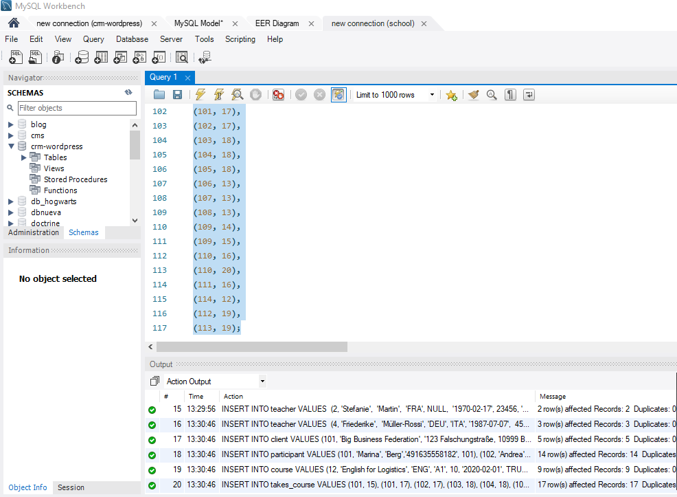

# base de datos esquema

 Velaquí un esquema en drawio de unha base de datos charteada primeiro en drawio (en vscode, adxunto nesta carpeta) e logo feita realidade en mysql bench seguindo o tutorial de .

